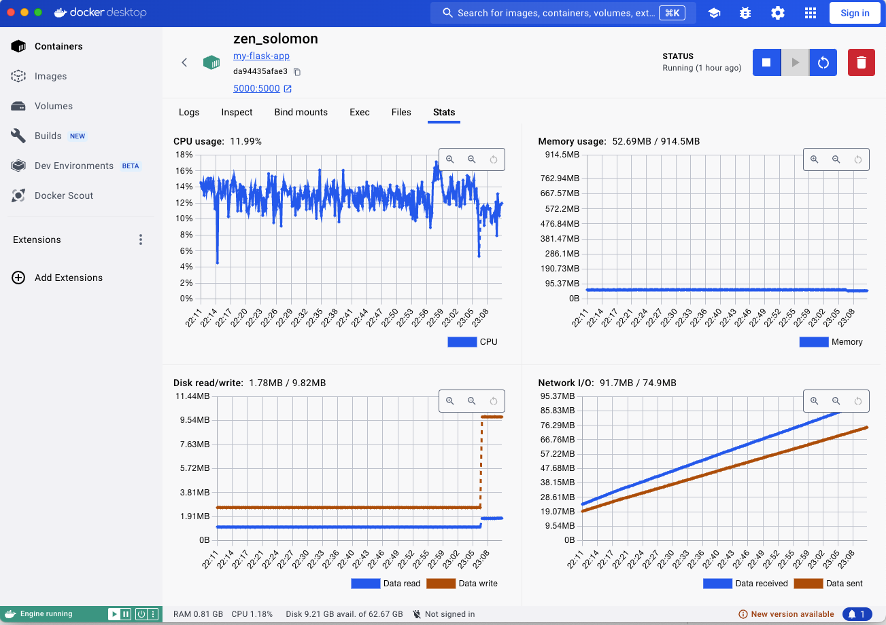

# SDK Benchmark

This repository contains benchmarks results and code to run load-test for the Optimizely SDKs

## Running the Benchmarks

To run the benchmarks, follow these steps:

1. Clone this repository.
2. Navigate to the project directory.
3. Run the benchmark script

## Benchmark system 

- Docker Container
- CPU 12 core
- Memory (32 GB Max)
- Load 1200 RPM

## SDK Ranking based on Memory and CPU Usage
   1. Go
   2. Ruby
   3. Python
   4. JS(Node)
   5. C#
   6. Java

*** Performance can vary in different system

## Benchmark Results

### Go

### Ruby

### Python

### JS(Node)

### C#

### Java

